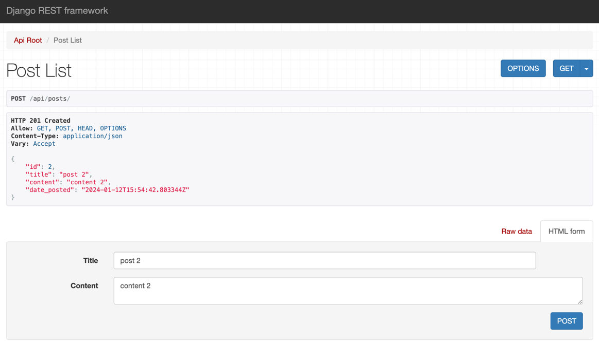

# Docker

## بخش عملی
یک پروژه ساده جنگو با استفاده از django-rest-framework درست می‌کنیم که یک مدل `Post` داشته و در دیتابیس postgres ذخیره می‌شود. برای این پروژه داکرفایل لازم را نوشته و در داکر کامپوز نیز دیتابیس و پروژه را تعریف می‌کنیم.

در ادامه ابتدا image مورد نظر برای پروژه را بیلد می‌کنیم:
```bash
docker compose build
```


حال با اجرای دستور زیر، پروژه را به وسیله داکر کامپوز اجرا می‌کنیم:
```bash
docker compose up -d
```


در ادامه با اجرای دستورات زیر، می‌توانیم نتیجه را ببینیم:
```bash
docker compose ps
docker image ls
```


حال با باز کردن آدرس `localhost:8000/api/posts/` در مرورگر صفحه‌ی api مورد نظر باز می‌شود.




حال برای افزایش تعداد کانتینرها می‌توانیم از دستور زیر استفاده کنیم:
```bash
docker compose scale backend=3
```
البته این دستور به طور ساده به دلیل مپ شدن هر پورت به طور مستقیم به لوکال هاست، کار نمی‌کند و برای استفاده از آن لازم است از یک nginx در نتورک داکر برای load-balancing استفاده کرده و پورت backend را از طریق nginx به بیرون expose کنیم.

## پرسش‌ها
### سوال ۱
در اینجا stateless یعنی سرویس بکند ما مستقیما هیچ دیتایی ذخیره نمی‌کند و فقط برای پیاده‌سازی business logic از آن استفاده می‌شود. بنابراین فرقی نمی‌کند ریکوئست کاربر به کدام کانتینر برود و هر کدام از کانتینرها با وصل بودن به دیتابیس یکسان می‌توانند جواب دقیقا یکسانی به کاربر بدهند.